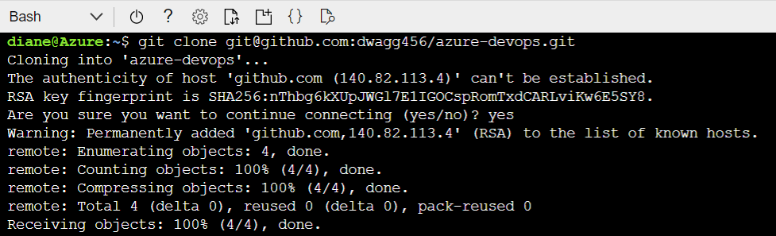
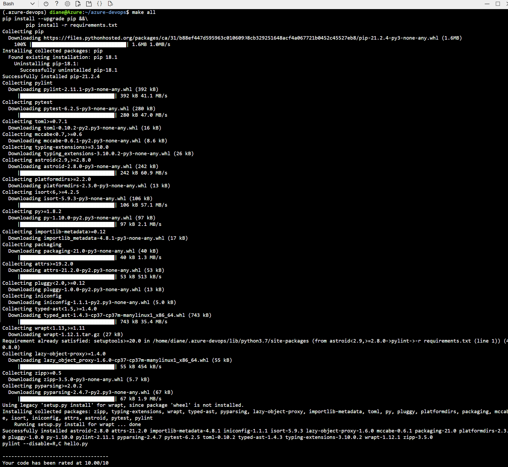
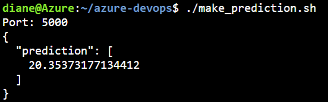
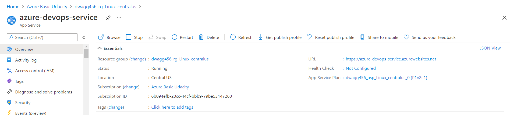
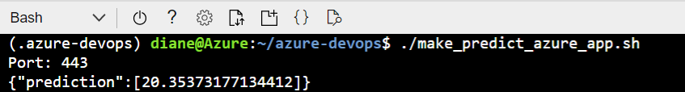
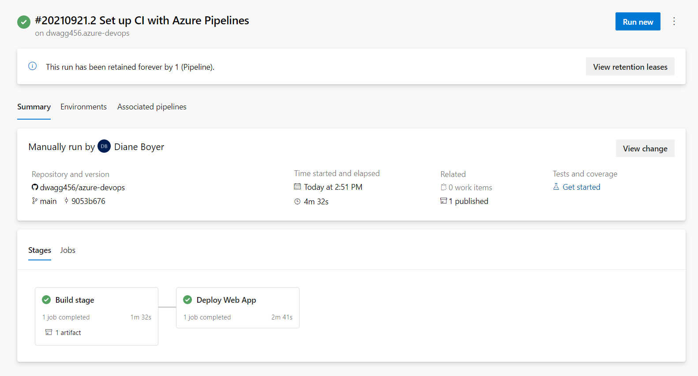
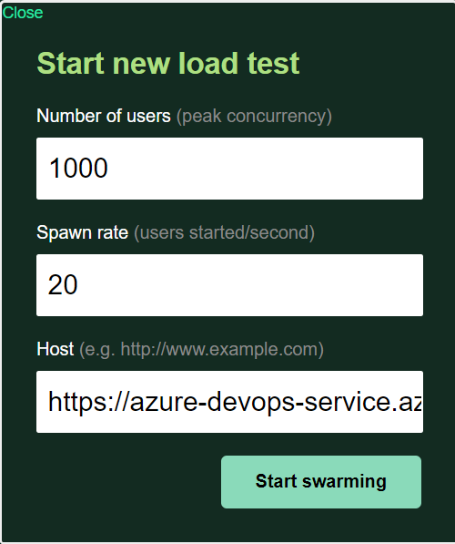
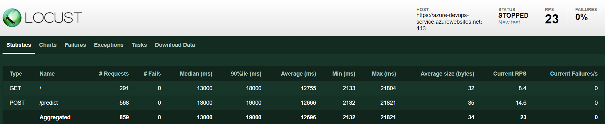

# Overview

This is the Building a CI/CD Pipeline project for the DevOps Engineer for Microsoft Azure Nanodegree Program at Udacity.

The project consists of a project plan spreadsheet and Trello board for planning and configuring continous integration and delivery for a sample webapp via Github Actions and Azure Pipelines. A video recording has been created to walk through the project and demo the deployed application.


## Project Plan

* [Trello Board](https://trello.com/b/atV0LJRZ/building-a-ci-cd-pipeline)
* [Project Plan Spreadsheet](https://github.com/dwagg456/azure-devops/blob/main/project-plan-spreadsheet.xls)


## Instructions

Architectural Diagram:


### Clone Project into Azure Cloud Shell

* Clone project into Azure Cloud Shell
```
git clone git@github.com:dwagg456/azure-devops.git
```


* Create a virtual environment
```
make setup
```
* Activate the virtual environment
```
source ~/.udacity-devops/bin/activate
```
* Run the `make all` command from the `Makefile` to install, lint, and test project
```
make all
```


* Start the application.
```
python app.py
```

* While app is running, open a new Cloud Shell environment and test that the application is working.



* As code changes are pushed to Github, verify that the tests pass in the Github Actions YAML file. 

[](https://github.com/dwagg456/azure-devops/actions/workflows/pythonapp.yml)


### Run Project on Azure App Service
* Create app service in Azure named azure-devops-service.
```
az webapp up --sku F1 -n azure-devops-service
```



* Run test prediction to verify app service is running.
```
./make_predict_azure_app.sh
```

* View results of prediction.



* View output of streamed log files
``` 
az webapp log tail --name azure-devops-service
```

* Configure pipeline at https://dev.azure.com to deploy the Python project to Azure as Linux Web App. 




### Load Test with Locust
* Start locust application
```
locust -f locustfile.py
```

* Open browser window to http://localhost:8089 to input specifications and begin load test.



* View loadtest results in GUI.




## Enhancements

Improvements to this project could be made by implementing alternate frameworks or languages. Additionally, much more robust testing could be implemented via Github Actions.

## Demo 

* [Demo Video](https://youtu.be/TJw2Rl38O-Y)


